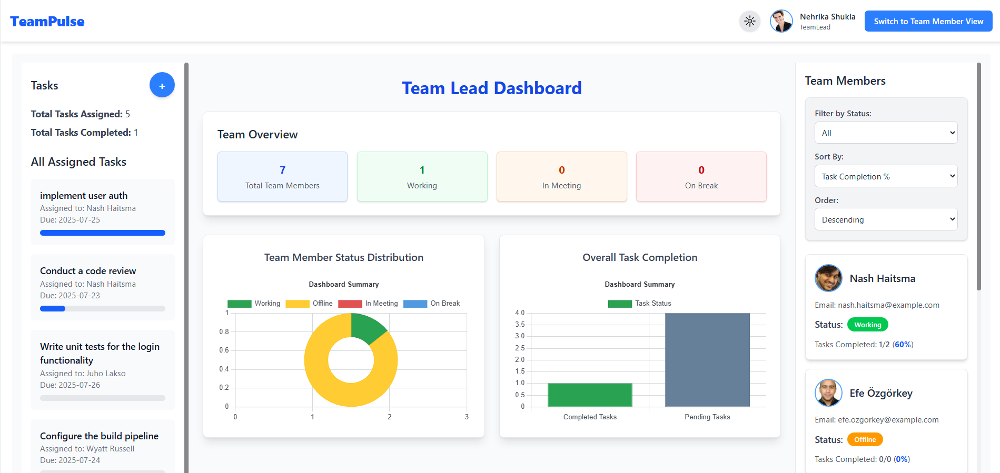
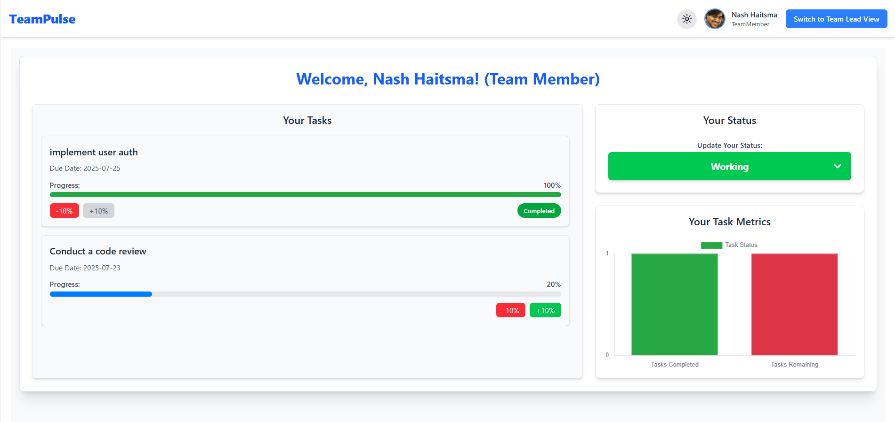

# Team Pulse Dashboard

A dynamic and responsive dashboard application built with React and Redux, designed to streamline task management and team monitoring for both Team Leads and Team Members. This internal tool provides role-specific views to enhance productivity and provide clear insights into team performance and task progress.

## [Live Demo](https://teampulsedash.netlify.app/)

## 📸 Screenshots

### Team Lead Dashboard



### Team Member Dashboard



---

## The Problem

- **Lack of Visibility:** In remote or hybrid work environments, it's challenging for team leads to maintain a clear view of their team's real-time status and task progress.
- **Inefficient Communication:** Relying on email or chat for status updates can be inefficient and lead to disorganized information.
- **Project Bottlenecks:** Without a centralized view, it's difficult to identify bottlenecks, uneven workload distribution, and potential delays.

## The Use Case

- **Centralized Monitoring:** Provides a single platform for team leads to monitor team member availability, status, and task assignments.
- **Improved Task Management:** Enables team leads to assign tasks and track their completion, while team members can easily view and update their own progress.
- **Enhanced Accountability:** Fosters a sense of transparency and accountability by making individual and team progress visible to everyone.
- **Data-Driven Insights:** Offers visual dashboards with charts to help team leads understand team performance and workload distribution at a glance.

---

## ✨ Features

This application features a role-based system with two distinct dashboards:

### 👨‍💼 Team Lead View

A comprehensive, three-column dashboard designed for oversight and management.

- **Team Status Monitor:**
  - At-a-glance summary cards showing the number of team members who are `Working`, `In a Meeting`, `On Break`, or `Offline`.
  - Detailed list of all team members with their current status badge.
- **Task Management:**
  - View all assigned tasks across the team.
  - Assign new tasks to team members via a pop-up modal with member selection, task title, and due date.
- **Data Visualization:**
  - Doughnut and Bar charts powered by Chart.js to visualize team metrics and workload distribution.
- **Filtering & Sorting:**
  - Filter the member list by their current status.
  - Sort members by name, task completion percentage, or total tasks.
- **Collapsible Layout:**
  - Side columns can be collapsed to focus on the main content, with a fully responsive design for all screen sizes.

### 👩‍💻 Team Member View

A personalized, two-column dashboard focused on individual tasks and status.

- **Task Management:**
  - View a personal list of all assigned tasks.
  - Update task progress in 10% increments using a sleek progress bar.
  - Tasks are automatically marked as complete when progress reaches 100%.
- **Status Control:**
  - Update your personal status (`Working`, `Break`, `Meeting`, `Offline`) with a simple dropdown menu.
  - The selected status is reflected globally for the Team Lead to see.
- **Personal Analytics:**
  - View a personal bar graph showing total assigned vs. completed tasks.

### General Features

- **Role Switching:** Seamlessly toggle between Team Lead and Team Member views.
- **Theme Toggle:** Switch between light and dark modes for a comfortable viewing experience.
- **State Management:** Centralized state managed by Redux Toolkit for a predictable and scalable application state.
- **Inactivity Detection:** Automatically sets a team member's status to "Offline" after a period of inactivity.

---

## 🛠️ Tech Stack

- **Frontend:** [React](https://reactjs.org/)
- **State Management:** [Redux Toolkit](https://redux-toolkit.js.org/)
- **Styling:** [Tailwind CSS](https://tailwindcss.com/)
- **Charts:** [Chart.js](https://www.chartjs.org/) with [react-chartjs-2](https://react-chartjs-2.js.org/)
- **Bundler:** [Vite](https://vitejs.dev/)

---

## 🚀 Getting Started

To get a local copy up and running, follow these simple steps.

### Prerequisites

- Node.js (v18 or later)
- npm or yarn

### Installation

1.  Clone the repo
    ```sh
    git clone https://github.com/your-username/team-pulse-dashboard.git
    ```
2.  Install NPM packages
    ```sh
    npm install
    ```
3.  Start the development server
    ```sh
    npm run dev
    ```

---

## 👤 Author

- **Raghav Goel**
- **LinkedIn:** [raghav-goel01](https://www.linkedin.com/in/raghav-goel01/)
